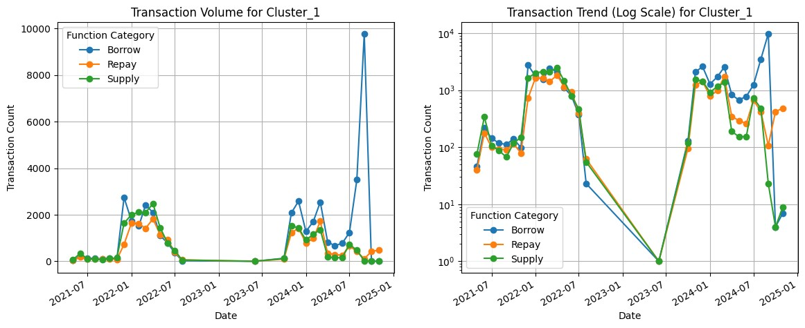
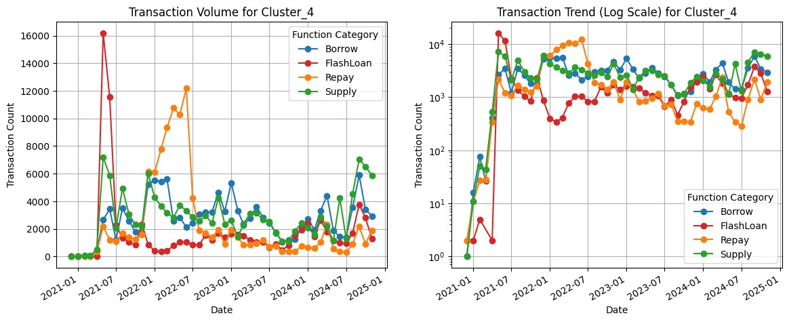
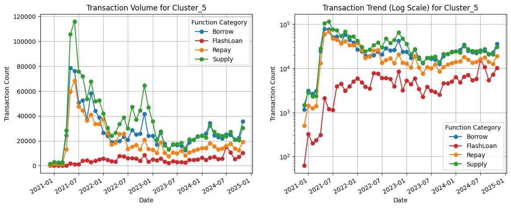
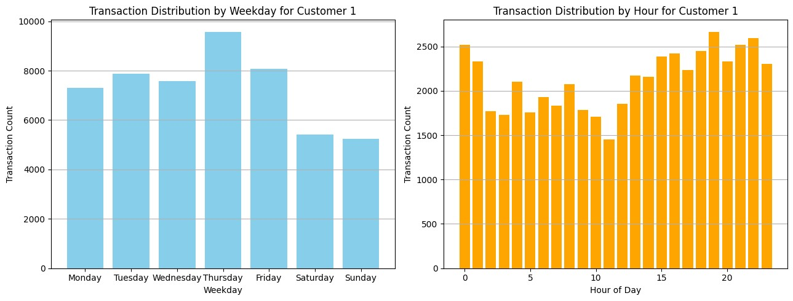

# AAVE User Ecosystem Analysis

## Table of Contents

### Part 1: AAVE Development History
### Part 2: User Segmentation
-	Analysis of transaction volume and behavior patterns of medium to highly active users
-	Detailed segmentation and behavior analysis of VIP professional users
-	Detailed segmentation and behavior analysis of high-frequency trading users
### Summary
-	AAVE development trends
-	User segmentation results
-	User transaction behavior characteristics
-	VIP professional users
-	Conclusions
-	Development recommendations

---

## Part 1: AAVE Development History
### Transaction Volume Across Different Blockchains

This section illustrates the transaction volume trends on various blockchains (Ethereum, Polygon, Avalanche, etc.) over time:

1. Ethereum:

    -	V2 Peak Activity: In its early stages (2021), Ethereum displayed consistently high transaction volumes, underscoring its role as the foundational core of the AAVE protocol.
    -	Impact of V3 Deployment: Following the introduction of V3, transaction volumes slightly increased but maintained a stable trend.
2. Polygon:

    -	Explosive Growth: Transaction volumes surged significantly following the deployment of Polygon in early 2021, demonstrating the appeal of its low transaction fees.
    -	Stabilization: After 2022, transaction volumes decreased and stabilized.
3. Avalanche:

    -	Short-Term Peak: A significant spike in transaction volumes was observed shortly after deployment in late 2021, followed by a rapid decline, indicating limited market acceptance.
4. Other Blockchains:

    -	Transaction volumes across other chains showed periodic spikes, such as the slight boost in Ethereum’s transaction volumes due to the new features introduced in V3.

Conclusion

Blockchain deployments initially drive significant transaction volume increases. However, as the market matures, transaction volumes tend to stabilize. Ethereum remains the mainstream platform, while low-cost chains like Polygon show outstanding performance during their early stages.

---

### Changes in Transaction Types

This section illustrates the daily transaction counts for various transaction types on AAVE, including Supply, FlashLoan, Borrow, Repay, Liquidation, and Withdraw:

1. Supply:

    -	Peak Period: Significant peaks were observed in 2021 and early 2022, potentially driven by increasing demand for stable returns.
    -	Stable Period: Post-2023, the volume of Supply transactions remained steady, indicating consistent long-term capital inflow.
2. FlashLoan:

    -	Short-Term Surges: Transaction volumes spiked in 2021 and early 2024, likely due to arbitrage opportunities or market volatility.
    -	Instability: Overall activity exhibited explosive growth followed by rapid declines, indicating that FlashLoan activity is predominantly driven by professional traders.
3. Borrow and Repay:

    -	Synchronized Fluctuations: Borrow and Repay transaction volumes moved in tandem, reflecting stable borrowing and repayment behavior.
    -	2024 Peak: A recent surge in transaction volumes suggests a revival in borrowing demand, potentially linked to market interest rates or asset needs.
4. Liquidation:

    -	Sparse but Impactful: Liquidation volumes were low overall, but concentrated spikes occurred during periods of market volatility (e.g., late 2021), suggesting that Liquidation behavior is primarily influenced by market conditions.
5. Withdraw:

    -	Stable with Occasional Peaks: Withdraw volumes were generally stable but occasionally experienced surges, likely reflecting market panic or increased liquidity demands.

Conclusion

Supply and borrowing activities represent the stable core of the AAVE protocol, forming its long-term foundation. In contrast, FlashLoan and Liquidation activities are more sensitive to market conditions. The recent (2024) transaction peaks warrant further investigation into possible causes, such as market volatility or protocol upgrades.

---

## Part 2: User Clustering

### User Clustering Results

1. **User Transaction Behavior Analysis**

    | Cluster | Number of Users | Average Total Transactions | Average Maximum Transaction Interval (Days) | Average Number of Transaction Cycles | Average Maximum Transactions per Cycle |
    |------|---------|----------------|---------------------|------------------|----------------------------|
    | 0 | 472,520 | 9.23 | 29.71 | 2.17 | 5.47 |
    | 1 | 2 | 57,000.50 | 66.88 | 16.00 | 12,888.50 |
    | 2 | 2 | 21,933.50 | 62.70 | 18.50 | 11,541.00 |
    | 3 | 40,177 | 19.92 | 471.01 | 5.77 | 7.24 |
    | 4 | 74 | 7,239.91 | 157.99 | 22.72 | 2,342.91 |
    | 5 | 24,690 | 203.69 | 185.89 | 18.61 | 53.05 |

2. **User Transaction Type Distribution Analysis**

    
    | Cluster | Number of Users | Average Total Transactions | Average Borrow Ratio | Average Supply Ratio | Average Flash Loan Ratio |
    |------|---------|----------------|--------------|--------------|----------------|
    | 0 | 472,520 | 9.23 | 20.81% | 41.25% | 3.98% |
    | 1 | 2 | 57,000.50 | 34.96% | 20.29% | 0.00% |
    | 2 | 2 | 21,933.50 | 0.00% | 0.00% | 99.99% |
    | 3 | 40,177 | 19.92 | 19.33% | 38.88% | 1.53% |
    | 4 | 74 | 7,239.91 | 23.90% | 29.08% | 16.47% |
    | 5 | 24,690 | 203.69 | 26.24% | 36.72% | 2.83% |

3. **Detailed Analysis of User Segmentation**

    | Cluster Type                     | Number of Users | Key Characteristics                                                                                               | Analysis                                                                                     |
    |:---------------------------------|:----------------|:-------------------------------------------------------------------------------------------------------------------|:--------------------------------------------------------------------------------------------|
    | Low Activity Regular Users (Group 0) | 472,520         | • Average Transactions: 9.23 • Average Maximum Transaction Interval: 29.71 days • Transaction Distribution:   - Supply: 41.25%   - Borrow: 20.81%   - Flash Loan: 3.98% | Regular users Low but evenly distributed transaction frequency Primarily provide core liquidity Show monthly cycle transaction patterns |
    | VIP Professional Users (Group 1)    | 2               | • Average Transactions: 57,000.50 • Average Maximum Transaction Interval: 66.88 days • Transaction Distribution:   - Borrow: 34.96%   - Supply: 20.29% | Core user group Extremely high transaction frequency Indicate stable and strong borrowing demand Likely institutional users |
    | Flash Loan Professional Users (Group 2) | 2           | • Average Transactions: 21,933.50 • Average Maximum Transaction Interval: 62.70 days • Transaction Distribution:   - Flash Loan: 99.99% | Professional arbitrageurs Specialized in high-frequency flash loan transactions |
    | Low Activity Long-term Users (Group 3) | 40,177         | • Average Transactions: 19.92 • Average Maximum Transaction Interval: 471.01 days • Transaction Distribution:   - Supply: 38.88%   - Borrow: 19.33%   - Flash Loan: 1.53% | Long-term low activity investors Provide stable capital support to the protocol |
    | High-frequency Professional Users (Group 4) | 74          | • Average Transactions: 7,239.91 • Average Maximum Transaction Interval: 157.99 days • Transaction Distribution:   - Supply: 29.08%   - Borrow: 23.90%   - Flash Loan: 16.47% | Long-term strategic investors Wide activity span Transaction volume indicates medium to high value |
    | Moderately High Activity Core Users (Group 5) | 24,690      | • Average Transactions: 203.69 • Average Maximum Transaction Interval: 185.89 days • Transaction Distribution:   - Supply: 36.72%   - Borrow: 26.24%   - Flash Loan: 2.83% | Stable core user group Diverse usage scenarios Contribute significantly to system stability |

---

### 中、高活躍用戶交易量變化與行為模式分析

***分群1：VIP專業用戶：***
- 用戶群是 VIP專業用戶，交易活動高度集中於 借貸 (Borrow/Repay)，且交易量極高。
-  活動明顯呈現 階段性，在某些時期有大量交易，而其他時期幾乎完全停止。
-  Borrow 交易 在 2025 年初達到顯著峰值，顯示這群用戶在此期間可能有策略性操作或市場機會的利用。
-  供應交易 (Supply) 相對較少，表明這群用戶更偏向於資產借貸，而非資產供應。

***分群2：閃電貸專業用戶***
1.	高度集中於閃電貸的專業用戶：
    - Cluster_2 用戶顯示出典型的閃電貸專業用戶特徵，在短時間內大量進行閃電貸操作，可能是進行套利或策略性交易的機構用戶。
2.	活動極具爆發性且不可持續：
    -	活動高峰過後迅速消失，2022 年後幾乎完全停止，可能是市場條件變化或策略不再有效，導致這些用戶退出市場。
3.	交易特徵：
    -	這群用戶的閃電貸交易數量集中在短時間內爆發，後續市場活躍度極低，反映出高度專業化但不穩定的交易行為。
4.	應用分析：
    -	這類用戶對於協議的短期流動性和交易量貢獻較大，但長期穩定性較差。適合關注策略套利者或市場波動期間的行為特徵。

***分群4：高頻專業用戶***
-	高頻專業用戶活動有明顯的 階段性：
    -	早期（2021 年中）出現了大規模的 FlashLoan 活動，可能是套利交易或策略性操作所導致。
    -	隨後交易活動逐步趨於穩定，尤其是在 Supply 和 Borrow 交易類別中。
-	Repay 活動 在 2022 年中達到高峰，顯示用戶集中進行償還行為，可能與市場利率或借貸需求變化有關。
-	FlashLoan 活動逐漸減少：
-	顯示出這類專業用戶逐漸減少對閃電貸的依賴，轉而進行穩定的供應和借貸活動。
-	整體來看，這群用戶雖然在 交易頻率 上有所起伏，但在 中長期內 的行為顯示出穩定的借貸、償還及供應活動。這類用戶可能包括長期策略投資者或高頻交易者。

***分群5：中高活躍核心用戶***
1. 高活躍核心用戶群（Cluster_5）：
    -	早期（2021 年）：用戶活動極為活躍，特別是資產供應和借貸交易，顯示這群用戶在協議剛啟動時提供了大量流動性。
    -	中期（2022-2023 年）：用戶活動逐漸趨於穩定，交易數量回落，主要集中於 Borrow 和 Repay 操作，表現出穩定的借貸需求。
    -	近期（2024 年）：交易量有輕微回升，顯示這群用戶可能開始新一波的借貸或供應活動。
2.	低閃電貸使用率：
    -	FlashLoan 數量始終較低，表明該群用戶並不依賴閃電貸，主要專注於穩定的借貸和供應操作。
3.	特徵總結：
    -	此群用戶是中高活躍的核心用戶，交易數量和活躍程度高於一般用戶，但低於專業用戶群。
    -	主要貢獻協議的基礎借貸和存款活動，維持了中等水平的交易頻率，並具備一定的周期性行為。

---

### **VIP專業用戶**細分與行為模式分析

***Customer 0***

1.	按星期分布（左圖）：
    -	交易高峰：星期三（約15,000筆交易），顯示該客戶在這一天特別活躍。
    -	交易低谷：週末（星期六與星期日），交易量明顯降低，顯示該客戶在週末參與較少。
    -	整體趨勢：交易集中於工作日，尤其是週三和週五。
2.	按小時分布（右圖）：
    -	交易高峰：UTC 時間 15:00 至 19:00（接近 4,000 筆交易），顯示該客戶在此時間段最活躍。
    -	交易低谷：UTC 0:00 至 8:00，顯示該客戶在夜間活動較少。
    -	整體趨勢：交易活動集中於 UTC 工作時段（白天至傍晚），可能對應其所在地區的工作時間。

***Customer 1***

1.	按星期分布（左圖）：
    -	交易高峰：星期四（接近10,000筆交易），其次為星期三與星期五。
    -	交易低谷：週末（星期六與星期日），交易量有所下降，但下降幅度比 Customer 0 更小。
    -	整體趨勢：該客戶在工作日更加活躍，但週末仍有一定交易活動，顯示更穩定的參與。
2.	按小時分布（右圖）：
    -	交易高峰：UTC 時間 20:00 至 23:00（約 2,500 筆交易），顯示該客戶晚間交易活躍度較高。
    -	交易低谷：UTC 5:00 至 10:00，顯示凌晨至上午活動較少。
    -	整體趨勢：交易活動在全天分布較為均勻，且稍微偏向晚間。

***比較與分析***
1.	交易時間偏好：
    -	Customer 0 更偏好於工作日的白天至傍晚（UTC 時間 15:00 至 19:00）。
    -	Customer 1 在晚間（UTC 時間 20:00 至 23:00）的交易活躍度更高，且週末活動稍多。
2.	地區推測：
    -	Customer 0 的高峰時段可能對應美洲時區（如東部時區 UTC-4 至 UTC-5）。
    -	Customer 1 的高峰時段可能對應歐洲或其他時區，特別是傍晚至晚間較為活躍。
3.	行為特徵：
    -	Customer 0 的交易活動更集中，顯示其交易可能與特定市場時間相關。
    -	Customer 1 的交易活動相對分散，顯示其參與更穩定，可能對應多策略交易或不同時區的市場參與。

***建議***
1.	針對 Customer 0：
    -	提供針對工作日交易的激勵措施（如周三或周五的手續費減免）。
    -	強化美洲市場對應時段的資金池流動性，滿足其交易需求。
2.	針對 Customer 1：
    -	推出晚間交易激勵方案（如 UTC 20:00 之後的獎勵），進一步吸引該用戶參與。
    -	如果該用戶的活動來自歐洲，則可針對歐洲市場提供專屬產品。

---

### **高頻交易用戶**細分與行為模式分析

***分群特徵與行為模式***

根據用戶活躍週期數量與平均每周期交易次數進行分群，高頻交易用戶可劃分為三類：Group 0（中週期高頻交易者）、Group 1（短週期高頻交易者） 和 Group 2（長週期高頻交易者）。每群用戶展現了顯著的行為模式與交易特徵。

| 特徵 | Group 0 (中週期高頻) | Group 1 (短週期高頻) | Group 2 (長週期高頻) |
|------|------------------------|------------------------|------------------------|
| 交易總量 | 179,956 | 295,290 | 60,507 |
| 唯一用戶數 | 24 | 44 | 6 |
| 單一用戶最大交易量 | 15,737 | 34,657 | 20,153 |
| 平均活躍週期數 | 1,308 | 379 | 2,479 |
| 平均每周期交易次數 | 7.57 | 40.3 | 4.83 |

***Group 0：中等週期高頻交易者***

特徵與行為
-	交易數量：179,956 筆，占總交易量的中間份額。
-	唯一用戶數：24 人，用戶數雖少但高度活躍。
-	平均活躍週期：1,308 個週期，顯示交易行為相對分散。
-	平均每周期交易次數：7.57 筆，屬於中等頻率的交易策略。

交易行為分析
-	每小時交易量分布：交易活躍時間分布均勻，全天持續交易，僅在 UTC 5:00-11:00稍有下降。
-	每日交易量趨勢：
    -	交易量自 2021 年逐步攀升，2023 年初達到高峰，隨後逐漸下降。
    -	整體交易趨勢穩定，但具有一定的季節性波動。
-	活躍周期與每周期交易量分布：
    -	平均每周期交易次數介於 4-8 筆，活躍周期數集中在 1000-1800(秒) 範圍。
    -	用戶參與度中等，交易量集中且穩定，表現出偏保守的交易模式。

***Group 1：短期週期高頻交易者***

特徵與行為
-	交易數量：295,290 筆，為所有分群中最高。
-	唯一用戶數：44 人，分群中最多。
-	平均活躍週期：379 個，顯示活躍周期短但交易密集。
-	平均每周期交易次數：40.30 筆，呈現極短時長的高頻交易模式。

交易行為分析
-	每小時交易量分布：交易活躍時間集中在 UTC 14:00 以後，接近 UTC 23:00 時達到峰值。
-	每日交易量趨勢：
    -	2021 年交易量快速增長，2022 年達到頂峰後迅速下降，波動較大。
    -	近期交易量有所回升，但波動性仍然顯著。
-	活躍周期與每周期交易量分布：
    -	每周期交易次數範圍廣泛，部分用戶單周期交易量超過 200 筆。
    -	活躍周期數偏低（< 600秒），顯示用戶專注於極短時長的高頻交易活動。

***Group 2：長週期高頻交易者***

特徵與行為
-	交易數量：60,507 筆，總交易量最低。
-	唯一用戶數：6 人，分群中最少。
-	平均活躍週期：2,479 個，為活躍周期數最高的群體。
-	平均每周期交易次數：4.83 筆，單周期交易頻率最低。
交易行為分析
-	每小時交易量分布：
    -	交易量在 UTC 1:00-9:00 時段偏低，UTC 16:00 左右達到高峰。
    -	每隔 4 小時交易量明顯波動，特別是在 UTC 0、4、8、12、16、20 點時交易量激增。
-	每日交易量趨勢：
    -	2022 年初交易量達到高峰後逐漸下降，整體趨勢穩定，波動性較低。
    -	交易量呈現明顯的季節性規律，顯示偏長週期、穩定的交易習慣。
-	活躍周期與每周期交易量分布：
    -	平均每周期交易次數為 4-5 筆，活躍周期數集中在 2000-3000(秒)。
    -	顯示用戶以低頻率但穩定的長週期交易為主，偏向穩健策略。

***建議***
1. 優化對穩定交易者的支持（Group 0）
    - 提供更加穩定的流動性挖礦或借貸激勵，進一步吸引和留住此群體，維持協議核心的流動性基礎。
    - 分析此群體的主要資產類型，針對其偏好優化相關市場。

2. 針對短期高頻交易者的需求（Group 1）
    - 增強交易性能（例如降低交易延遲）以滿足高頻交易需求，吸引更專業的高頻交易者參與。
    - 提供更細緻的報酬結構，例如基於交易量或頻率的動態激勵措施。
    - 監測此群體對市場價格影響，防止高頻交易導致過度波動。

3. 支持長週期穩健策略者（Group 2）
    - 為此群體提供長期持有激勵，例如更高的質押收益或長期借貸折扣。
    - 強化數據透明度與風險控制，吸引對穩定回報敏感的用戶參與。

4. 時間段優化策略

    - 根據各群體的活躍時段（如 UTC 14:00-23:00 為 Group 1 的高峰），安排後台資源的優化配置，降低高峰時段的交易擁堵。

5. 建立精細化客戶分層策略

    - 利用上述分群結果進一步分析資產偏好與交易模式，針對不同類型用戶制定個性化推廣與激勵方案，提高用戶忠誠度與協議使用率。

---

## 總結
本次 AAVE 用戶生態分析，以用戶行為特徵為核心，結合不同區塊鏈的交易數據和分群結果，全面呈現了 AAVE 生態系統中的用戶組成、行為模式及交易特徵。通過對用戶活躍週期、交易次數及交易類型的深入研究，我們得出以下結論：

1. AAVE 發展趨勢

    AAVE 的發展初期（如 2021 年）受益於新的區塊鏈部署和協議升級，交易量顯著提升。隨著市場成熟，交易量趨於穩定。低交易成本的區塊鏈（如 Polygon）吸引了大量早期用戶，但 Ethereum 仍然是協議的核心基礎。

2. 用戶分群結果

    根據交易數據與行為特徵，AAVE用戶被劃分為6個主要群體，每個群體有不同的行為特徵與貢獻：

    - 低活躍普通用戶：人數最多（47萬餘人），交易頻率低但分布均勻，主要為協議提供基礎流動性。
    - VIP專業用戶：交易頻率極高，主要專注於借貸操作，對系統流動性具重要貢獻。
    - 閃電貸專業用戶：交易活動高度集中於閃電貸，爆發性強但不穩定。
    - 低活躍長期用戶：交易頻率低，活躍時間跨度長，主要貢獻穩定存款流動性。
    - 高頻專業用戶：交易頻率高，活動呈階段性，且有明顯的交易策略。
    - 中高活躍核心用戶：交易活動穩定，借貸與供應行為均衡，主要維持系統中高水平的流動性。

3. 用戶交易模式特徵

    - 交易類型多元化：供應（Supply）和借貸（Borrow/Repay）交易構成了協議的核心基礎活動，而閃電貸和清算則主要受到市場條件的影響。
    - 時間分布規律：用戶的交易活動在不同時段呈現顯著特徵，部分群體（如 高頻專業用戶 Group 1）集中於特定時間段，而其他群體（如 高頻專業用戶 Group 0）則交易分布更均勻。

4. VIP 專業用戶

    此群體雖人數較少，但交易活動密集，貢獻了協議的高交易量。其行為對市場流動性有重要影響，建議針對該群體優化資源配置與激勵措施。

5. 結論

    AAVE 的用戶生態由多層次的參與者組成，每個群體在協議中扮演了不同的角色，共同促成了生態系統的穩定性與多樣性。用戶交易模式展現出一定的穩定性與季節性波動，而高頻交易者和專業用戶的參與則為協議帶來了顯著的短期流動性貢獻。閃電貸和借貸活動作為協議的重要組成部分，顯示了市場對不同交易模式的需求與適應能力。

6. 發展建議

    - 提升用戶體驗
        - 開發直觀易用的 Web3 介面，降低用戶的學習門檻，吸引傳統 Web2 用戶進入 DeFi 領域。
        - 多設備支持：優化行動裝置介面，確保使用者能夠隨時隨地進行交易。
        - 教育推廣：結合使用者指南與模擬教學，讓新用戶快速掌握 AAVE 的基本操作與功能，提升參與率。

    - 優化基礎流動性
        - 激勵穩健用戶：針對普通用戶及穩健策略用戶，提供穩定的流動性挖礦、借貸優惠或長期收益回饋計劃，鼓勵資金穩定流入協議。
        - 增加多元資產支持：擴展支持的代幣種類，吸引更多用戶參與，進一步鞏固 AAVE 在市場中的流動性優勢。

    - 支持高頻交易需求
        - 提升交易性能：透過優化智能合約執行效率和區塊鏈交易速度，降低延遲和手續費，滿足高頻交易需求。
        - 激勵機制：針對高頻交易者推出階梯式交易回饋或特定時段手續費減免，以吸引專業參與者。
        - API 擴展：提供穩定的開發者工具及交易 API，吸引機構投資者與量化交易團隊參與。

    - 監控市場波動
        - 市場監控工具：開發即時數據儀表板，觀察高頻交易和閃電貸對市場流動性及價格的影響，快速響應潛在風險。
        - 市場穩定措施：在極端市場條件下，啟動交易限制或調整清算機制，防止市場過度波動。

    - 時間段與市場優化
        - 資源配置：根據用戶活躍時段（如 UTC 14:00-23:00）動態調整協議後台資源，減少高峰期交易擁堵，提升用戶體驗。
        - 定制化激勵：針對特定高峰時段推出激勵措施，如在特定時間段提高借貸收益或降低手續費，吸引更多用戶參與。

    - 精細化客戶分層管理
        - 精準行銷：利用分群數據，針對不同用戶提供個性化的促銷活動或產品建議，例如針對穩健策略用戶推廣低風險產品，針對高頻交易者提供高流動性市場資訊。
        - 用戶數據洞察：定期分析用戶行為與資產偏好，針對市場變化進行策略調整，確保用戶需求得到滿足。

    - AB測試鎖定客戶地區
        - 區域分析：根據用戶密集交易時段進行地區推測，透過 A/B 測試驗證用戶來源並進行精準定位。
        - 定制地區策略：針對不同地區用戶的需求與偏好，推出專屬的促銷計劃及激勵措施，如針對歐洲用戶調整 UTC 時段激勵或針對亞洲市場增加本地化產品。
        - 多語言支持：完善平台多語言功能，降低非英語用戶的參與門檻。

這些建議旨在全方位提升 AAVE 的用戶體驗、資金效率與市場競爭力，幫助協議持續擴展市場規模，同時鞏固其在 DeFi 生態系統中的領先地位。