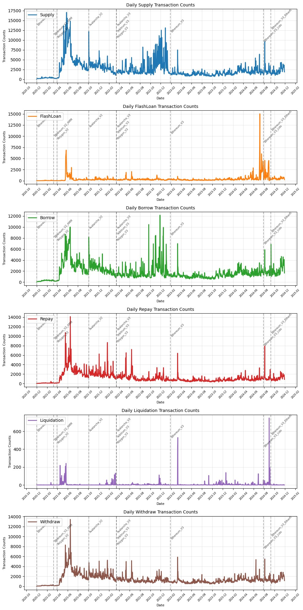
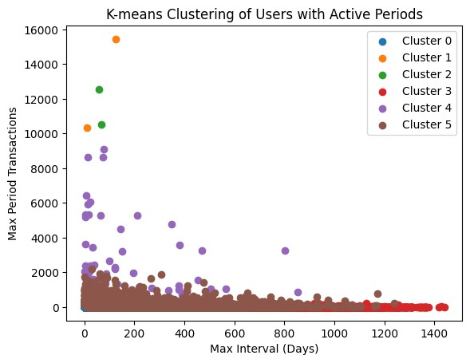
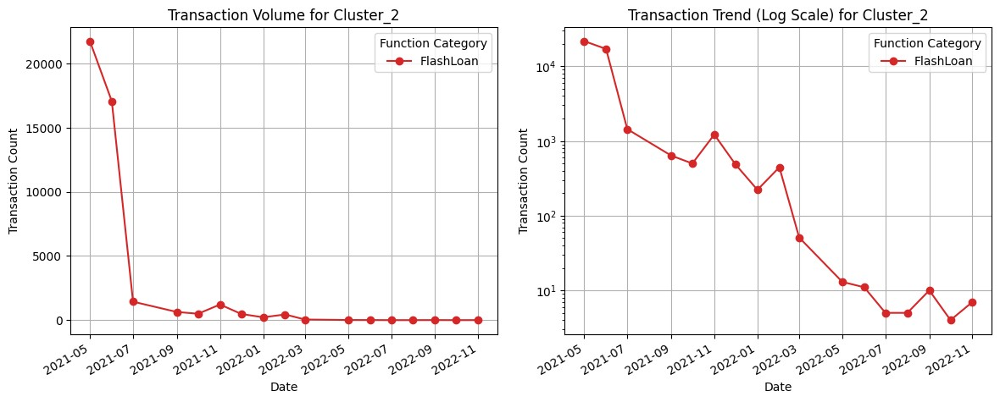
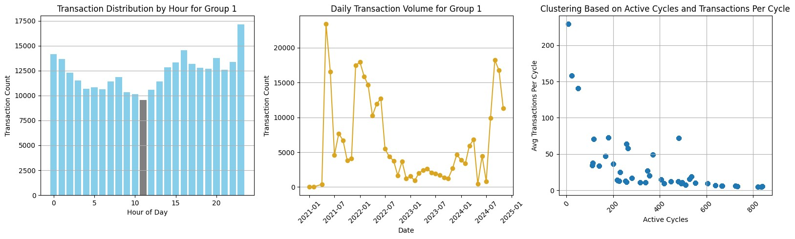
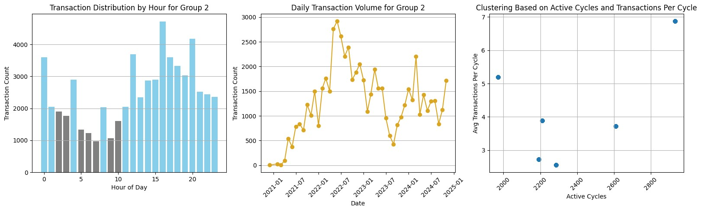

# AAVE User Ecosystem Analysis

## Table of Contents

### Part 1: AAVE Development History
### Part 2: User Segmentation
- Analysis of transaction volume and behavior patterns of medium to highly active users
- Detailed segmentation and behavior analysis of VIP professional users
- Detailed segmentation and behavior analysis of high-frequency trading users
### Summary
- AAVE development trends
- User segmentation results
- User transaction behavior characteristics
- VIP professional users
- Conclusions
- Development recommendations

---

## Part 1: AAVE Development History

### Transaction Volume Across Different Blockchains

This section highlights transaction volume trends on various blockchains (Ethereum, Polygon, Avalanche, etc.) over time:

1. **Ethereum**:
    - **V2 Peak Activity**: In its early stages (2021), Ethereum consistently exhibited high transaction volumes, underscoring its role as the foundational core of the AAVE protocol.
    - **Impact of V3 Deployment**: Following the introduction of V3, transaction volumes slightly increased but generally stabilized.

2. **Polygon**:
    - **Explosive Growth**: Transaction volumes surged significantly after Polygon’s deployment in early 2021, demonstrating the appeal of its low transaction fees.
    - **Stabilization**: After 2022, transaction volumes decreased and maintained a steady trend.

3. **Avalanche**:
    - **Short-Term Peak**: Avalanche experienced a significant spike in transaction volumes shortly after its late 2021 deployment, followed by a rapid decline, indicating limited market acceptance.

4. **Other Blockchains**:
    - Transaction volumes on other blockchains showed periodic spikes, such as the slight boost in Ethereum’s activity due to new features introduced in V3.

**Conclusion**  
Blockchain deployments initially drive significant transaction volume increases. However, as the market matures, transaction volumes stabilize. Ethereum remains the mainstream platform, while low-cost chains like Polygon excel in their early stages.

---

### Changes in Transaction Types

This section analyzes daily transaction counts for various transaction types on AAVE, including **Supply**, **FlashLoan**, **Borrow**, **Repay**, **Liquidation**, and **Withdraw**:

1. **Supply**:
    - **Peak Period**: Notable peaks were observed in 2021 and early 2022, likely driven by growing demand for stable returns.
    - **Stable Period**: Post-2023, Supply transactions stabilized, indicating steady long-term capital inflows.

2. **FlashLoan**:
    - **Short-Term Surges**: Significant spikes in 2021 and early 2024 were likely due to arbitrage opportunities or market volatility.
    - **Instability**: FlashLoan activity displayed explosive growth followed by rapid declines, indicative of its reliance on professional traders.

3. **Borrow and Repay**:
    - **Synchronized Fluctuations**: Borrow and Repay volumes exhibited tandem movements, reflecting consistent borrowing and repayment behavior.
    - **2024 Peak**: A recent surge in transaction volumes suggests renewed borrowing demand, potentially linked to market interest rates or asset needs.

4. **Liquidation**:
    - **Sparse but Impactful**: While overall Liquidation volumes were low, concentrated spikes occurred during periods of market volatility (e.g., late 2021), indicating that Liquidation behavior is primarily influenced by market conditions.

5. **Withdraw**:
    - **Stable with Occasional Peaks**: Withdraw volumes were generally stable but saw occasional surges, likely due to market panic or increased liquidity demands.

**Conclusion**  
Supply and Borrow/Repay activities form the stable foundation of the AAVE protocol. In contrast, FlashLoan and Liquidation activities are more sensitive to market conditions. Recent transaction peaks in 2024 merit further investigation into potential causes such as market volatility or protocol upgrades.

---

## Part 2: User Clustering

### User Clustering Results

1. **User Transaction Behavior Analysis**

    | Cluster | Number of Users | Average Total Transactions | Average Maximum Transaction Interval (Days) | Average Number of Transaction Cycles | Average Maximum Transactions per Cycle |
    |------|---------|----------------|---------------------|------------------|----------------------------|
    | 0 | 472,520 | 9.23 | 29.71 | 2.17 | 5.47 |
    | 1 | 2 | 57,000.50 | 66.88 | 16.00 | 12,888.50 |
    | 2 | 2 | 21,933.50 | 62.70 | 18.50 | 11,541.00 |
    | 3 | 40,177 | 19.92 | 471.01 | 5.77 | 7.24 |
    | 4 | 74 | 7,239.91 | 157.99 | 22.72 | 2,342.91 |
    | 5 | 24,690 | 203.69 | 185.89 | 18.61 | 53.05 |

2. **User Transaction Type Distribution Analysis**

    
    | Cluster | Number of Users | Average Total Transactions | Average Borrow Ratio | Average Supply Ratio | Average Flash Loan Ratio |
    |------|---------|----------------|--------------|--------------|----------------|
    | 0 | 472,520 | 9.23 | 20.81% | 41.25% | 3.98% |
    | 1 | 2 | 57,000.50 | 34.96% | 20.29% | 0.00% |
    | 2 | 2 | 21,933.50 | 0.00% | 0.00% | 99.99% |
    | 3 | 40,177 | 19.92 | 19.33% | 38.88% | 1.53% |
    | 4 | 74 | 7,239.91 | 23.90% | 29.08% | 16.47% |
    | 5 | 24,690 | 203.69 | 26.24% | 36.72% | 2.83% |

3. **Detailed Analysis of User Segmentation**

    | Cluster Type                     | Number of Users | Key Characteristics                                                                                               | Analysis                                                                                     |
    |:---------------------------------|:----------------|:-------------------------------------------------------------------------------------------------------------------|:--------------------------------------------------------------------------------------------|
    | Low Activity Regular Users (Group 0) | 472,520         | • Average Transactions: 9.23 • Average Maximum Transaction Interval: 29.71 days • Transaction Distribution:   - Supply: 41.25%   - Borrow: 20.81%   - Flash Loan: 3.98% | Regular users Low but evenly distributed transaction frequency Primarily provide core liquidity Show monthly cycle transaction patterns |
    | VIP Professional Users (Group 1)    | 2               | • Average Transactions: 57,000.50 • Average Maximum Transaction Interval: 66.88 days • Transaction Distribution:   - Borrow: 34.96%   - Supply: 20.29% | Core user group Extremely high transaction frequency Indicate stable and strong borrowing demand Likely institutional users |
    | Flash Loan Professional Users (Group 2) | 2           | • Average Transactions: 21,933.50 • Average Maximum Transaction Interval: 62.70 days • Transaction Distribution:   - Flash Loan: 99.99% | Professional arbitrageurs Specialized in high-frequency flash loan transactions |
    | Low Activity Long-term Users (Group 3) | 40,177         | • Average Transactions: 19.92 • Average Maximum Transaction Interval: 471.01 days • Transaction Distribution:   - Supply: 38.88%   - Borrow: 19.33%   - Flash Loan: 1.53% | Long-term low activity investors Provide stable capital support to the protocol |
    | High-frequency Professional Users (Group 4) | 74          | • Average Transactions: 7,239.91 • Average Maximum Transaction Interval: 157.99 days • Transaction Distribution:   - Supply: 29.08%   - Borrow: 23.90%   - Flash Loan: 16.47% | Long-term strategic investors Wide activity span Transaction volume indicates medium to high value |
    | Moderately High Activity Core Users (Group 5) | 24,690      | • Average Transactions: 203.69 • Average Maximum Transaction Interval: 185.89 days • Transaction Distribution:   - Supply: 36.72%   - Borrow: 26.24%   - Flash Loan: 2.83% | Stable core user group Diverse usage scenarios Contribute significantly to system stability |

---

### Analysis of Transaction Volume Changes and Behavioral Patterns for Mid-to-High Activity Users

***Cluster 1: VIP Professional Users***
- This user group comprises VIP professional users with trading activities highly concentrated in borrowing (Borrow/Repay), and their transaction volumes are extremely high.
- Their activity exhibits clear phases, with large volumes of transactions during certain periods and almost no activity during others.
- Borrowing transactions peaked significantly in early 2025, indicating that these users may have engaged in strategic operations or taken advantage of market opportunities during this period.
- Supply transactions are relatively rare, suggesting that this group leans more toward asset borrowing than supplying assets.

***Cluster 2: Flash Loan Professional Users***
1. Highly Specialized in Flash Loans:

    - Cluster 2 users display typical characteristics of professional flash loan users, engaging in large volumes of flash loan operations over short periods, likely for arbitrage or strategic trading, often as institutional participants.
2. Explosive but Unsustainable Activity:

    - Activity peaks abruptly and disappears just as quickly. After 2022, there was almost no activity, possibly due to changes in market conditions or the obsolescence of certain strategies, leading these users to exit the market.
3. Transaction Characteristics:

    - These users exhibit a burst of flash loan transactions within short periods, followed by significantly low market activity, reflecting highly specialized but unstable trading behavior.
4. Application Analysis:

    - This user group contributes significantly to the protocol's short-term liquidity and transaction volume but offers limited long-term stability. They are worth monitoring for insights into arbitrage strategies or behaviors during periods of market volatility.

***Cluster 4: High-Frequency Professional Users***
- Phased Activity Patterns:

    - In the early phase (mid-2021), there was significant FlashLoan activity, likely driven by arbitrage or strategic trading operations.
    - Over time, transaction activity stabilized, particularly in the Supply and Borrow categories.
- Repay Activity Peaks in Mid-2022:

    - This indicates a concentrated effort to repay loans, potentially influenced by changes in market interest rates or borrowing demand.
- Declining FlashLoan Activity:

    - This trend suggests that these professional users gradually reduced their reliance on flash loans, shifting toward more stable supply and borrowing activities.
- Overall Behavior:

    - Although transaction frequency fluctuated, this group exhibited stable borrowing, repayment, and supply behavior over the medium to long term. These users may include long-term strategic investors or high-frequency traders.

***Cluster 5: Mid-to-High Activity Core Users***
1. Highly Active Core Users (Cluster 5):

    - Early Phase (2021): User activity was extremely high, particularly in asset supply and borrowing transactions, indicating that this group provided significant liquidity when the protocol first launched.
    - Middle Phase (2022-2023): Activity gradually stabilized, with transaction volumes decreasing and focusing primarily on Borrow and Repay operations, reflecting consistent borrowing needs.
    - Recent Phase (2024): Transaction volumes showed a slight uptick, suggesting a potential new wave of borrowing or supply activity.
2. Low FlashLoan Usage:

    - FlashLoan transactions remained consistently low, indicating that this user group does not rely on flash loans and instead focuses on stable borrowing and supply operations.
3. Summary of Characteristics:

    - This group represents the mid-to-high activity core users, with transaction volumes and activity levels higher than general users but lower than professional user groups.
    - They primarily contribute to the protocol’s foundational lending and deposit activities, maintaining moderate transaction frequency and exhibiting some cyclical behavior.

---

### **VIP Professional Users** Subdivision and Behavioral Pattern Analysis

***Customer 0***

1. Weekly Distribution (Left Chart):

    - Peak Activity: Wednesday (around 15,000 transactions), indicating heightened activity on this day.
    - Lowest Activity: Weekends (Saturday and Sunday), with significantly reduced transaction volumes, suggesting less engagement during these days.
    - Overall Trend: Transactions are concentrated on weekdays, especially Wednesdays and Fridays.
2. Hourly Distribution (Right Chart):

    - Peak Activity: UTC 15:00 to 19:00 (close to 4,000 transactions), indicating the highest activity during this time.
    - Lowest Activity: UTC 0:00 to 8:00, reflecting minimal activity during nighttime hours.
    - Overall Trend: Transaction activity is concentrated during UTC working hours (daytime to early evening), likely corresponding to working hours in their region.

***Customer 1***

1. Weekly Distribution (Left Chart):

    - Peak Activity: Thursday (nearly 10,000 transactions), followed by Wednesday and Friday.
    - Lowest Activity: Weekends (Saturday and Sunday), with a decline in activity, although the drop is less pronounced compared to Customer 0.
    - Overall Trend: The user is more active on weekdays but maintains a moderate level of activity during weekends, indicating more stable participation.
2. Hourly Distribution (Right Chart):

    - Peak Activity: UTC 20:00 to 23:00 (around 2,500 transactions), indicating higher activity during the evening hours.
    - Lowest Activity: UTC 5:00 to 10:00, reflecting lower activity in the early morning.
    - Overall Trend: Transactions are more evenly distributed throughout the day, with a slight preference for evening activity.

***Comparison and Analysis***
1. Transaction Timing Preferences:

    - Customer 0 prefers daytime to early evening on weekdays (UTC 15:00 to 19:00).
    - Customer 1 shows higher activity during evening hours (UTC 20:00 to 23:00) and slightly more weekend participation.
2. Regional Inference:

    - Customer 0’s peak hours likely align with the Americas time zones (e.g., Eastern Time UTC-4 to UTC-5).
    - Customer 1’s peak hours may correspond to European or other time zones, particularly with higher evening activity.
3. Behavioral Characteristics:

    - Customer 0’s activity is more concentrated, suggesting their transactions may align with specific market hours.
    - Customer 1’s activity is more evenly distributed, indicating stable participation, possibly driven by multi-strategy trading or engagement in markets across various time zones.

***Recommendations***
1. For Customer 0:

    - Offer weekday trading incentives (e.g., fee reductions on Wednesdays or Fridays).
    - Enhance liquidity in funding pools during peak Americas market hours to meet their transaction demands.
2. For Customer 1:

    - Introduce evening trading rewards (e.g., incentives for transactions after UTC 20:00) to further encourage participation.
    - If this user’s activity is based in Europe, consider providing Europe-specific products to cater to their preferences.

---

### **High-Frequency Traders** Subdivision and Behavioral Pattern Analysis

***Cluster Characteristics and Behavioral Patterns***

Based on the number of active cycles and the average number of transactions per cycle, high-frequency traders can be divided into three groups: **Group 0** (Medium-Cycle High-Frequency Traders), **Group 1** (Short-Cycle High-Frequency Traders), and **Group 2** (Long-Cycle High-Frequency Traders). Each group exhibits distinct behavioral patterns and trading characteristics.

| Feature                  | Group 0 (Medium-Cycle HF) | Group 1 (Short-Cycle HF) | Group 2 (Long-Cycle HF) |
|--------------------------|------------------------------|-----------------------------|----------------------------|
| Total Transactions       | 179,956                     | 295,290                     | 60,507                     |
| Unique Users             | 24                          | 44                          | 6                          |
| Max Transactions per User| 15,737                      | 34,657                      | 20,153                     |
| Avg. Active Cycles       | 1,308                       | 379                         | 2,479                      |
| Avg. Transactions/Cycle  | 7.57                        | 40.3                        | 4.83                       |

---

***Group 0: Medium-Cycle High-Frequency Traders***

**Characteristics and Behavior**  
- **Total Transactions**: 179,956, accounting for a moderate share of the total.  
- **Unique Users**: 24 users, a small but highly active group.  
- **Avg. Active Cycles**: 1,308 cycles, indicating relatively dispersed trading activity.  
- **Avg. Transactions/Cycle**: 7.57, reflecting a medium-frequency trading strategy.  

**Behavioral Analysis**  
- **Hourly Transaction Distribution**: Activity is evenly distributed throughout the day, with a slight drop between UTC 5:00 and 11:00.  
- **Daily Transaction Trends**:  
    - Transaction volumes gradually increased from 2021, peaked in early 2023, and then gradually declined.  
    - Overall trading trends are stable but exhibit seasonal fluctuations.  
- **Active Cycle and Per-Cycle Transaction Distribution**:  
    - Average transactions per cycle range from 4 to 8, with active cycle counts concentrated in the range of 1,000 to 1,800 (seconds).  
    - User engagement is moderate, with concentrated and stable transaction volumes, reflecting a relatively conservative trading pattern.  

***Group 1: Short-Cycle High-Frequency Traders***

**Characteristics and Behavior**  
- **Total Transactions**: 295,290, the highest among all groups.  
- **Unique Users**: 44, the largest number of users among the groups.  
- **Avg. Active Cycles**: 379, indicating short active cycles with dense trading activity.  
- **Avg. Transactions/Cycle**: 40.30, representing an ultra-high-frequency trading pattern over short durations.  

**Behavioral Analysis**  
- **Hourly Transaction Distribution**: Trading activity is concentrated after UTC 14:00, peaking around UTC 23:00.  
- **Daily Transaction Trends**:  
    - Rapid growth in transaction volumes during 2021, peaking in 2022, followed by a sharp decline and significant volatility.  
    - Recent transaction volumes show a slight recovery but remain highly volatile.  
- **Active Cycle and Per-Cycle Transaction Distribution**:  
    - Transaction counts per cycle vary widely, with some users exceeding 200 transactions in a single cycle.  
    - Active cycles are relatively short (< 600 seconds), showing a focus on high-frequency trading within short durations.  

---

***Group 2: Long-Cycle High-Frequency Traders***

**Characteristics and Behavior**  
- **Total Transactions**: 60,507, the lowest among all groups.  
- **Unique Users**: 6, the smallest user base among the groups.  
- **Avg. Active Cycles**: 2,479, the highest number of active cycles.  
- **Avg. Transactions/Cycle**: 4.83, reflecting the lowest transaction frequency per cycle.  

**Behavioral Analysis**  
- **Hourly Transaction Distribution**:  
    - Lower transaction volumes between UTC 1:00 and 9:00, peaking around UTC 16:00.  
    - Significant fluctuations every 4 hours, with transaction surges at UTC 0, 4, 8, 12, 16, and 20.  
- **Daily Transaction Trends**:  
    - Transaction volumes peaked in early 2022 and then gradually declined, showing an overall stable trend with low volatility.  
    - Seasonal patterns are evident, indicating a preference for long-cycle and steady trading habits.  
- **Active Cycle and Per-Cycle Transaction Distribution**:  
    - Average transactions per cycle range from 4 to 5, with active cycles concentrated between 2,000 and 3,000 seconds.  
    - This reflects a focus on low-frequency but stable long-cycle trading, favoring conservative strategies.  

---

***Recommendations***

1. **Enhancing Support for Stable Traders (Group 0)**  
    - Provide more stable liquidity mining or lending incentives to attract and retain this group, maintaining the protocol’s core liquidity foundation.  
    - Analyze the primary asset types favored by this group and optimize related markets based on their preferences.  

2. **Addressing the Needs of Short-Cycle High-Frequency Traders (Group 1)**  
    - Improve trading performance (e.g., reduce transaction latency) to meet high-frequency trading demands and attract more professional HFT participants.  
    - Offer more granular reward structures, such as dynamic incentives based on trading volume or frequency.  
    - Monitor the market impact of this group to prevent excessive volatility caused by high-frequency trading.  

3. **Supporting Long-Cycle Conservative Traders (Group 2)**  
    - Provide long-term holding incentives, such as higher staking yields or long-term borrowing discounts.  
    - Enhance data transparency and risk controls to attract users sensitive to stable returns.  

4. **Optimizing Strategies by Active Time Periods**  
    - Allocate backend resources strategically during peak hours (e.g., UTC 14:00–23:00 for Group 1) to reduce congestion during high-activity periods.  

5. **Developing a Fine-Grained Customer Segmentation Strategy**  
    - Use the above clustering results to further analyze asset preferences and trading patterns, creating personalized promotions and incentive plans for different user types to enhance user loyalty and protocol usage rates.  

---

## Summary

This AAVE user ecosystem analysis focuses on user behavioral characteristics, combining transaction data across different blockchains and clustering results to comprehensively present the user composition, behavioral patterns, and trading features within the AAVE ecosystem. By deeply examining user activity cycles, transaction frequency, and transaction types, we draw the following conclusions:

1. **AAVE Development Trends**

    AAVE experienced significant growth in its early stages (e.g., 2021), driven by new blockchain deployments and protocol upgrades. As the market matured, transaction volumes stabilized. Low-cost blockchains (e.g., Polygon) attracted a large number of early users, but Ethereum remains the protocol's core foundation.

2. **User Clustering Results**

    Based on transaction data and behavioral characteristics, AAVE users are categorized into six major groups, each with distinct behaviors and contributions:
    
    - **Low-Activity General Users**: The largest group (470,000+ users) with low transaction frequency but even distribution, providing foundational liquidity for the protocol.
    - **VIP Professional Users**: Extremely high transaction frequency, focusing mainly on lending operations, significantly contributing to system liquidity.
    - **Flash Loan Professionals**: Highly concentrated flash loan activity with explosive but unstable participation.
    - **Low-Activity Long-Term Users**: Low transaction frequency over long active spans, contributing stable deposit liquidity.
    - **High-Frequency Professionals**: High transaction frequency with phased activity and noticeable trading strategies.
    - **Mid-to-High Activity Core Users**: Stable trading activity with balanced lending and supplying behavior, maintaining mid-to-high-level liquidity.

3. **User Transaction Pattern Characteristics**

    - **Transaction Diversity**: Supply and Borrow/Repay transactions form the core activities of the protocol, while Flash Loan and liquidation activities are influenced mainly by market conditions.
    - **Time Distribution Patterns**: User activity varies significantly across time, with certain groups (e.g., Group 1 High-Frequency Professionals) concentrated during specific periods, while others (e.g., Group 0 High-Frequency Professionals) have more evenly distributed transactions.

4. **VIP Professional Users**

    Despite being a smaller group, this cluster exhibits intensive trading activity and contributes significantly to transaction volume. Their behavior greatly impacts market liquidity, suggesting the need for targeted resource optimization and incentives for this group.

5. **Conclusions**

    AAVE's user ecosystem comprises a multi-layered participant structure, with each group playing distinct roles to enhance the ecosystem's stability and diversity. User transaction patterns exhibit both stability and seasonal fluctuations, while the participation of high-frequency traders and professionals provides substantial short-term liquidity. Flash Loan and lending activities are vital components, reflecting the market's demand for various trading models.

6. **Recommendations**

    - **Enhancing User Experience**:
        - Develop intuitive Web3 interfaces to lower the learning curve and attract traditional Web2 users to DeFi.
        - Multi-device support: Optimize mobile interfaces to enable seamless trading anytime, anywhere.
        - Education and outreach: Combine user guides and simulated tutorials to help new users quickly grasp AAVE's features and operations, boosting participation.

    - **Optimizing Core Liquidity**:
        - Incentivize stable users: Offer consistent liquidity mining rewards, lending discounts, or long-term yield programs to encourage steady fund inflow.
        - Expand supported assets: Broaden the range of supported tokens to attract more participants and strengthen AAVE's market liquidity advantage.

    - **Meeting High-Frequency Trading Needs**:
        - Improve trading performance: Optimize smart contract execution and blockchain transaction speed to reduce latency and fees.
        - Incentive mechanisms: Introduce tiered trading rewards or fee reductions during specific time periods to attract professional participants.
        - API expansion: Provide stable developer tools and trading APIs to attract institutional investors and quantitative trading teams.

    - **Monitoring Market Volatility**:
        - Market monitoring tools: Develop real-time data dashboards to observe the impact of high-frequency trading and flash loans on liquidity and prices, enabling quick risk responses.
        - Stability measures: Activate transaction limits or adjust liquidation mechanisms during extreme market conditions to prevent excessive volatility.

    - **Time-Based and Market Optimization**:
        - Resource allocation: Dynamically adjust protocol backend resources based on user activity periods (e.g., UTC 14:00-23:00) to reduce congestion during peak times and improve user experience.
        - Time-specific incentives: Introduce rewards for specific peak periods, such as increased borrowing yields or reduced fees, to attract more participants.

    - **Refined Customer Segmentation Management**:
        - Targeted marketing: Use clustering data to offer personalized promotions or product recommendations, such as promoting low-risk products to stable strategy users or providing high-liquidity market insights to high-frequency traders.
        - User data insights: Regularly analyze user behavior and asset preferences to adjust strategies according to market changes, ensuring user needs are met.

    - **A/B Testing for Regional Targeting**:
        - Regional analysis: Use dense transaction time periods to infer user regions and validate through A/B testing for precise targeting.
        - Custom regional strategies: Offer region-specific promotions and incentives, such as adjusting UTC-based rewards for European users or adding localized products for Asian markets.
        - Multi-language support: Enhance the platform's multilingual capabilities to lower the participation barrier for non-English-speaking users.

These recommendations aim to comprehensively enhance AAVE's user experience, capital efficiency, and market competitiveness, helping the protocol expand its market scale while solidifying its leadership position in the DeFi ecosystem.
