# AAVE 用戶生態分析

## 目錄

### 第一部分：AAVE發展歷史
### 第二部分：用戶分群
-	針對中高活躍用戶，觀察交易量變化
-	針對VIP專業用戶，觀察每日交易習慣，推測用戶分布地區
-	針對高頻專業用戶，觀察每日交易習慣，推測用戶分布地區
### 結論
-	AAVE發展趨勢
-	用戶分群結果
-	用戶行為特徵與地區分布
-	用戶交易模式
-	策略建議

---

## 第一部分：AAVE發展歷史
### 各區塊鏈的交易數量變化
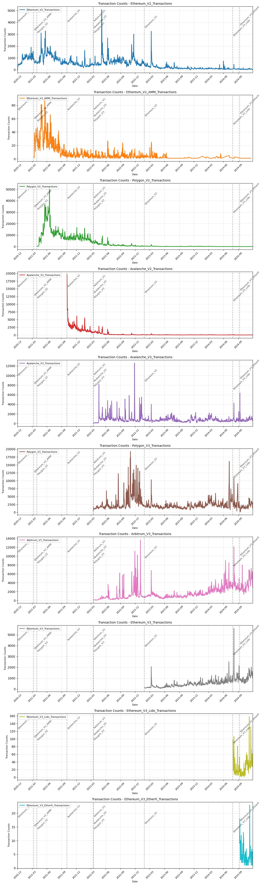

呈現了AAVE在不同區塊鏈（Ethereum、Polygon、Avalanche 等）上的交易數量變化，按時間分布：
1.	Ethereum：
    -	V2交易高峰：在早期（2021年）顯示穩定的高交易量，說明Ethereum是AAVE協議的核心基礎。
    -	V3部署影響：隨著V3的推出，交易量略有提升，但仍顯示平穩的趨勢。
2.	Polygon：
    -	爆發性增長：2021年初，Polygon部署後交易量顯著增長，顯示其低交易費用對用戶吸引力。
    -	回歸平穩：2022年後交易量下降並趨於穩定。
3.	Avalanche：
    -	短期高峰：部署後初期（2021年末）交易量大幅增加，但快速回落，顯示市場接受度有限。
4.	其他鏈：
    -	在不同鏈的交易數量呈現階段性高峰，如Ethereum的V3新增功能對交易量略有帶動作用。

結論

區塊鏈部署的初期對交易量有顯著推動，但隨著市場成熟，交易量逐漸回歸穩定。Ethereum仍是主流，但低成本鏈（如Polygon）在早期表現突出。

---

### 各交易類型數量變化
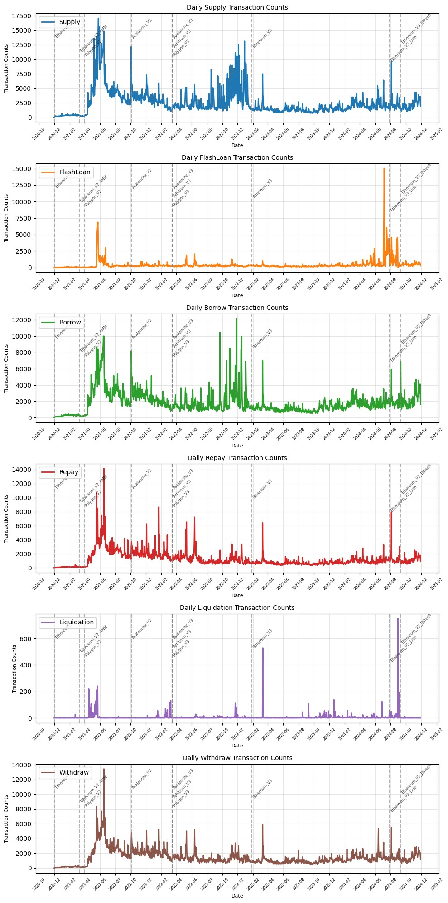

展示了AAVE的每日交易類型數量，包括供應（Supply）、閃電貸（FlashLoan）、借款（Borrow）、償還（Repay）、清算（Liquidation）和提款（Withdraw）：
1.	Supply（供應）：
    -	高峰期：2021年和2022年初出現明顯高峰，可能與用戶對穩定收益的需求增長相關。
    -	穩定期：2023年後供應交易量保持穩定，顯示長期穩定的資金流入。
2.	FlashLoan（閃電貸）：
    -	短期爆發：2021年和2024年初交易量激增，可能因套利機會或市場波動導致。
    -	不穩定性：整體活動呈現爆發性且快速回落，說明其主要由專業交易者驅動。
3.	Borrow（借款）與 Repay（償還）：
    -	同步波動：借款和償還交易量呈現同步波動，顯示穩定的借貸行為。
    -	2024年交易高峰：近期借貸需求略有回升，可能與市場利率或資產需求相關。
4.	Liquidation（清算）：
    -	稀疏但高影響：清算交易量極低，但在市場波動期（如2021年末）會出現集中高峰，顯示清算行為主要受市場條件影響。
5.	Withdraw（提款）：
    -	穩定但波動：提款交易數量穩定，但偶爾出現高峰，可能反映市場恐慌或資金需求增加。

結論

供應與借貸交易活動穩定，成為AAVE協議長期的核心基礎，而閃電貸和清算則受市場條件高度影響。近期（2024年）的交易高峰值得進一步研究可能原因，如市場波動或協議升級的影響。

---

## 第二部分：用戶分群

### 用戶分群結果
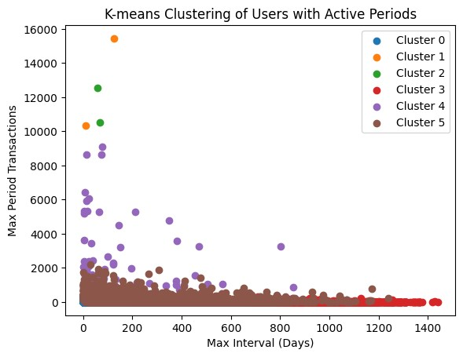

1. **用戶交易行為特徵分析**

    | 分群 | 用戶數 | 平均總交易次數 | 平均最大交易間隔(天) | 平均交易周期數量 | 平均每交易周期內最大交易次數 |
    |------|---------|----------------|---------------------|------------------|----------------------------|
    | 0 | 472,520 | 9.23 | 29.71 | 2.17 | 5.47 |
    | 1 | 2 | 57,000.50 | 66.88 | 16.00 | 12,888.50 |
    | 2 | 2 | 21,933.50 | 62.70 | 18.50 | 11,541.00 |
    | 3 | 40,177 | 19.92 | 471.01 | 5.77 | 7.24 |
    | 4 | 74 | 7,239.91 | 157.99 | 22.72 | 2,342.91 |
    | 5 | 24,690 | 203.69 | 185.89 | 18.61 | 53.05 |

2. **用戶交易類型分布分析**

    | 分群 | 用戶數 | 平均總交易次數 | 平均借款比例 | 平均存款比例 | 平均閃電貸比例 |
    |------|---------|----------------|--------------|--------------|----------------|
    | 0 | 472,520 | 9.23 | 20.81% | 41.25% | 3.98% |
    | 1 | 2 | 57,000.50 | 34.96% | 20.29% | 0.00% |
    | 2 | 2 | 21,933.50 | 0.00% | 0.00% | 99.99% |
    | 3 | 40,177 | 19.92 | 19.33% | 38.88% | 1.53% |
    | 4 | 74 | 7,239.91 | 23.90% | 29.08% | 16.47% |
    | 5 | 24,690 | 203.69 | 26.24% | 36.72% | 2.83% |

3. **用戶分群詳細分析**

    | 分群類型 | 用戶數量 | 主要特徵 | 分析 |
    |:---------|:----------|:----------|:----|
    | 低活躍普通用戶 (Group 0) | 472,520 | • 平均交易次數：9.23次 • 平均最大交易間隔：29.71天 • 交易分布：   - 存款 41.25%   - 借款 20.81%   - 閃電貸 3.98% | 普通用戶 交易頻率低但分布均勻 主要為協議提供基礎流動性 呈現月週期交易模式 |
    | VIP專業用戶 (Group 1) | 2 | • 平均交易次數：57,000.50次 • 平均最大交易間隔：66.88天 • 交易分布：   - 借款 34.96%   - 存款 20.29% | 核心用戶群體 交易頻率極高 顯示穩定且強烈的借貸需求 可能為機構用戶 |
    | 閃電貸專業用戶 (Group 2) | 2 | • 平均交易次數：21,933.50次 • 平均最大交易間隔：62.70天 • 交易分布：   - 閃電貸 99.99% | 專業套利者 專注於高頻閃電貸交易 |
    | 低活躍長期用戶 (Group 3) | 40,177 | • 平均交易次數：19.92次 • 平均最大交易間隔：471.01天 • 交易分布：   - 存款 38.88%   - 借款 19.33%   - 閃電貸 1.53% | 長期低活躍投資者 為協議提供穩定的資金支持 |
    | 高頻專業用戶 (Group 4) | 74 | • 平均交易次數：7,239.91次 • 平均最大交易間隔：157.99天 • 交易分布：   - 存款 29.08%   - 借款 23.90%   - 閃電貸 16.47% | 長期策略投資者 活動時間跨度大 交易量顯示中高價值 |
    | 中高活躍核心用戶 (Group 5) | 24,690 | • 平均交易次數：203.69次 • 平均最大交易間隔：185.89天 • 交易分布：   - 存款 36.72%   - 借款 26.24%   - 閃電貸 2.83% | 穩定的核心用戶群體 使用場景多元化 對系統穩定性貢獻較大 |

---

### 針對中高活躍用戶，觀察交易量變化

***分群1：VIP專業用戶：***
- 用戶群是 VIP專業用戶，交易活動高度集中於 借貸 (Borrow/Repay)，且交易量極高。
-  活動明顯呈現 階段性，在某些時期有大量交易，而其他時期幾乎完全停止。
-  Borrow 交易 在 2025 年初達到顯著峰值，顯示這群用戶在此期間可能有策略性操作或市場機會的利用。
-  供應交易 (Supply) 相對較少，表明這群用戶更偏向於資產借貸，而非資產供應。

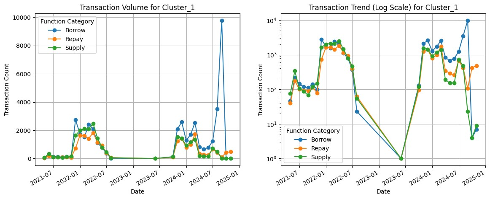

***分群2：閃電貸專業用戶***
1.	高度集中於閃電貸的專業用戶：
    - Cluster_2 用戶顯示出典型的閃電貸專業用戶特徵，在短時間內大量進行閃電貸操作，可能是進行套利或策略性交易的機構用戶。
2.	活動極具爆發性且不可持續：
    -	活動高峰過後迅速消失，2022 年後幾乎完全停止，可能是市場條件變化或策略不再有效，導致這些用戶退出市場。
3.	交易特徵：
    -	這群用戶的閃電貸交易數量集中在短時間內爆發，後續市場活躍度極低，反映出高度專業化但不穩定的交易行為。
4.	應用分析：
    -	這類用戶對於協議的短期流動性和交易量貢獻較大，但長期穩定性較差。適合關注策略套利者或市場波動期間的行為特徵。

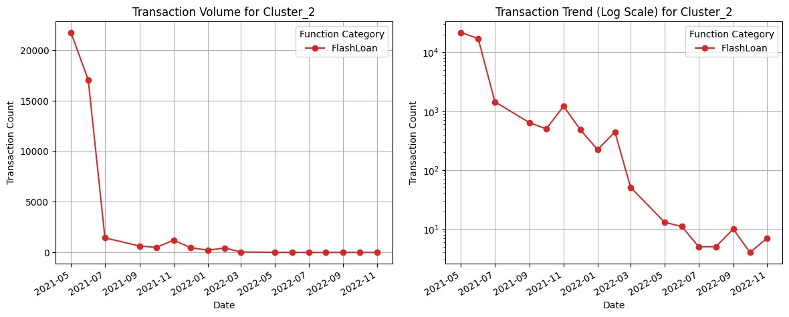

***分群4：高頻專業用戶***
-	高頻專業用戶活動有明顯的 階段性：
    -	早期（2021 年中）出現了大規模的 FlashLoan 活動，可能是套利交易或策略性操作所導致。
    -	隨後交易活動逐步趨於穩定，尤其是在 Supply 和 Borrow 交易類別中。
-	Repay 活動 在 2022 年中達到高峰，顯示用戶集中進行償還行為，可能與市場利率或借貸需求變化有關。
-	FlashLoan 活動逐漸減少：
-	顯示出這類專業用戶逐漸減少對閃電貸的依賴，轉而進行穩定的供應和借貸活動。
-	整體來看，這群用戶雖然在 交易頻率 上有所起伏，但在 中長期內 的行為顯示出穩定的借貸、償還及供應活動。這類用戶可能包括長期策略投資者或高頻交易者。

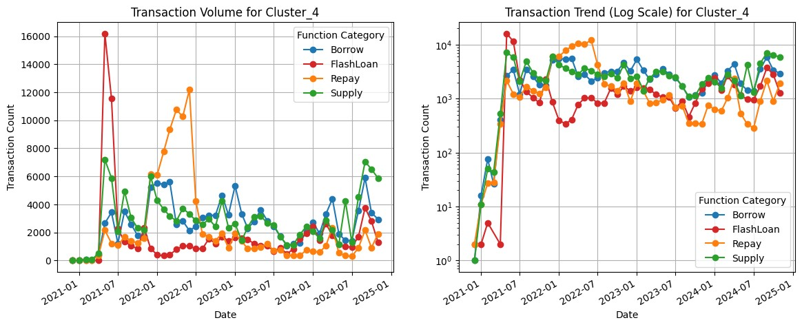

***分群5：中高活躍核心用戶***
1. 高活躍核心用戶群（Cluster_5）：
    -	早期（2021 年）：用戶活動極為活躍，特別是資產供應和借貸交易，顯示這群用戶在協議剛啟動時提供了大量流動性。
    -	中期（2022-2023 年）：用戶活動逐漸趨於穩定，交易數量回落，主要集中於 Borrow 和 Repay 操作，表現出穩定的借貸需求。
    -	近期（2024 年）：交易量有輕微回升，顯示這群用戶可能開始新一波的借貸或供應活動。
2.	低閃電貸使用率：
    -	FlashLoan 數量始終較低，表明該群用戶並不依賴閃電貸，主要專注於穩定的借貸和供應操作。
3.	特徵總結：
    -	此群用戶是中高活躍的核心用戶，交易數量和活躍程度高於一般用戶，但低於專業用戶群。
    -	主要貢獻協議的基礎借貸和存款活動，維持了中等水平的交易頻率，並具備一定的周期性行為。

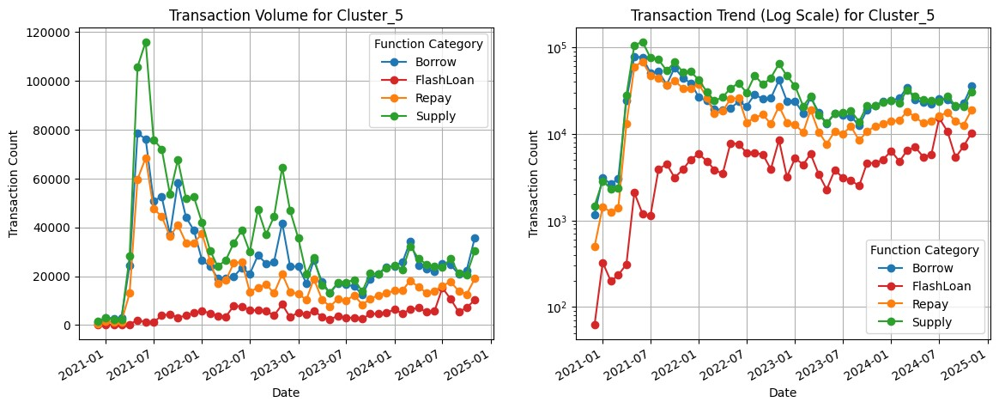

---

### 針對VIP專業用戶，觀察每日交易習慣

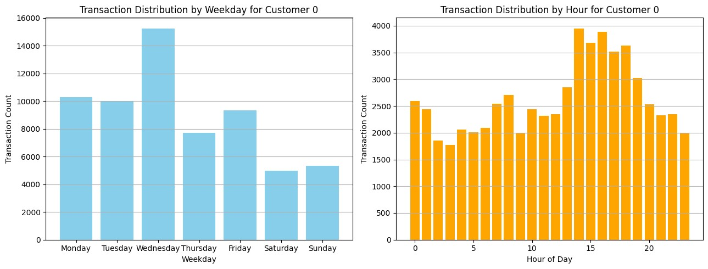
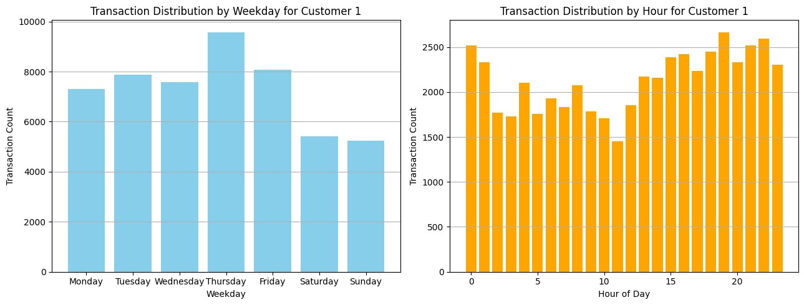

***Customer 0***
1.	按星期分布（左圖）：
    -	交易高峰：星期三（約15,000筆交易），顯示該客戶在這一天特別活躍。
    -	交易低谷：週末（星期六與星期日），交易量明顯降低，顯示該客戶在週末參與較少。
    -	整體趨勢：交易集中於工作日，尤其是週三和週五。
2.	按小時分布（右圖）：
    -	交易高峰：UTC 時間 15:00 至 19:00（接近 4,000 筆交易），顯示該客戶在此時間段最活躍。
    -	交易低谷：UTC 0:00 至 8:00，顯示該客戶在夜間活動較少。
    -	整體趨勢：交易活動集中於 UTC 工作時段（白天至傍晚），可能對應其所在地區的工作時間。

***Customer 1***
1.	按星期分布（左圖）：
    -	交易高峰：星期四（接近10,000筆交易），其次為星期三與星期五。
    -	交易低谷：週末（星期六與星期日），交易量有所下降，但下降幅度比 Customer 0 更小。
    -	整體趨勢：該客戶在工作日更加活躍，但週末仍有一定交易活動，顯示更穩定的參與。
2.	按小時分布（右圖）：
    -	交易高峰：UTC 時間 20:00 至 23:00（約 2,500 筆交易），顯示該客戶晚間交易活躍度較高。
    -	交易低谷：UTC 5:00 至 10:00，顯示凌晨至上午活動較少。
    -	整體趨勢：交易活動在全天分布較為均勻，且稍微偏向晚間。

***比較與分析***
1.	交易時間偏好：
    -	Customer 0 更偏好於工作日的白天至傍晚（UTC 時間 15:00 至 19:00）。
    -	Customer 1 在晚間（UTC 時間 20:00 至 23:00）的交易活躍度更高，且週末活動稍多。
2.	地區推測：
    -	Customer 0 的高峰時段可能對應美洲時區（如東部時區 UTC-4 至 UTC-5）。
    -	Customer 1 的高峰時段可能對應歐洲或其他時區，特別是傍晚至晚間較為活躍。
3.	行為特徵：
    -	Customer 0 的交易活動更集中，顯示其交易可能與特定市場時間相關。
    -	Customer 1 的交易活動相對分散，顯示其參與更穩定，可能對應多策略交易或不同時區的市場參與。

***建議***
1.	針對 Customer 0：
    -	提供針對工作日交易的激勵措施（如周三或周五的手續費減免）。
    -	強化美洲市場對應時段的資金池流動性，滿足其交易需求。
2.	針對 Customer 1：
    -	推出晚間交易激勵方案（如 UTC 20:00 之後的獎勵），進一步吸引該用戶參與。
    -	如果該用戶的活動來自歐洲，則可針對歐洲市場提供專屬產品。

---

### 高頻交易用戶細分與行為模式分析

***分群特徵與行為模式***

根據用戶活躍週期數量與平均每周期交易次數進行分群，高頻交易用戶可劃分為三類：Group 0（中週期高頻交易者）、Group 1（短週期高頻交易者） 和 Group 2（長週期高頻交易者）。每群用戶展現了顯著的行為模式與交易特徵。

| 特徵 | Group 0 (中週期高頻) | Group 1 (短週期高頻) | Group 2 (長週期高頻) |
|------|------------------------|------------------------|------------------------|
| 交易總量 | 179,956 | 295,290 | 60,507 |
| 唯一用戶數 | 24 | 44 | 6 |
| 單一用戶最大交易量 | 15,737 | 34,657 | 20,153 |
| 平均活躍週期數 | 1,308 | 379 | 2,479 |
| 平均每周期交易次數 | 7.57 | 40.3 | 4.83 |

***Group 0：中等週期高頻交易者***

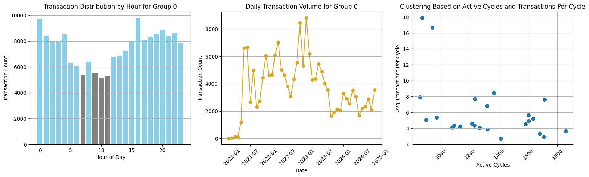

特徵與行為
-	交易數量：179,956 筆，占總交易量的中間份額。
-	唯一用戶數：24 人，用戶數雖少但高度活躍。
-	平均活躍週期：1,308 個週期，顯示交易行為相對分散。
-	平均每周期交易次數：7.57 筆，屬於中等頻率的交易策略。

交易行為分析
-	每小時交易量分布：交易活躍時間分布均勻，全天持續交易，僅在 UTC 5:00-11:00稍有下降。
-	每日交易量趨勢：
    -	交易量自 2021 年逐步攀升，2023 年初達到高峰，隨後逐漸下降。
    -	整體交易趨勢穩定，但具有一定的季節性波動。
-	活躍周期與每周期交易量分布：
    -	平均每周期交易次數介於 4-8 筆，活躍周期數集中在 1000-1800(秒) 範圍。
    -	用戶參與度中等，交易量集中且穩定，表現出偏保守的交易模式。

***Group 1：短期週期高頻交易者***

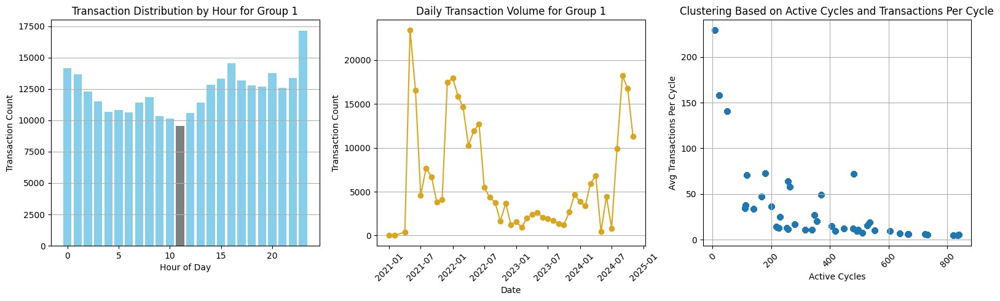

特徵與行為
-	交易數量：295,290 筆，為所有分群中最高。
-	唯一用戶數：44 人，分群中最多。
-	平均活躍週期：379 個，顯示活躍周期短但交易密集。
-	平均每周期交易次數：40.30 筆，呈現極短時長的高頻交易模式。

交易行為分析
-	每小時交易量分布：交易活躍時間集中在 UTC 14:00 以後，接近 UTC 23:00 時達到峰值。
-	每日交易量趨勢：
    -	2021 年交易量快速增長，2022 年達到頂峰後迅速下降，波動較大。
    -	近期交易量有所回升，但波動性仍然顯著。
-	活躍周期與每周期交易量分布：
    -	每周期交易次數範圍廣泛，部分用戶單周期交易量超過 200 筆。
    -	活躍周期數偏低（< 600秒），顯示用戶專注於極短時長的高頻交易活動。

***Group 2：長週期高頻交易者***

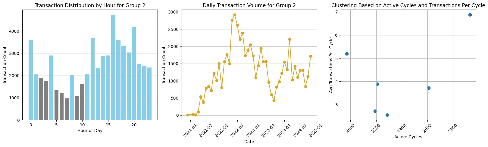

特徵與行為
-	交易數量：60,507 筆，總交易量最低。
-	唯一用戶數：6 人，分群中最少。
-	平均活躍週期：2,479 個，為活躍周期數最高的群體。
-	平均每周期交易次數：4.83 筆，單周期交易頻率最低。
交易行為分析
-	每小時交易量分布：
    -	交易量在 UTC 1:00-9:00 時段偏低，UTC 16:00 左右達到高峰。
    -	每隔 4 小時交易量明顯波動，特別是在 UTC 0、4、8、12、16、20 點時交易量激增。
-	每日交易量趨勢：
    -	2022 年初交易量達到高峰後逐漸下降，整體趨勢穩定，波動性較低。
    -	交易量呈現明顯的季節性規律，顯示偏長週期、穩定的交易習慣。
-	活躍周期與每周期交易量分布：
    -	平均每周期交易次數為 4-5 筆，活躍周期數集中在 2000-3000(秒)。
    -	顯示用戶以低頻率但穩定的長週期交易為主，偏向穩健策略。
